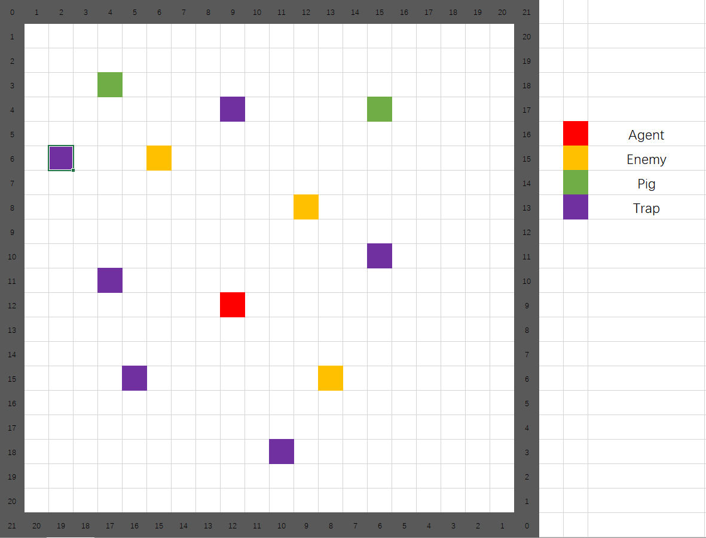

## Project Summary:

As its name suggest, our project idea is inspired by the most polular vedio game PlayerUnknown's Battlegrouds. The goal of this project is to have an agent to survive in the 40x40 flat ground with three enemies(zombies) and two pigs ramdonly in the environment. The agent should survive as long as possible to escape from the acttack of zombies or to kill pigs to increase its health points. The picture below for reference:

As for the challenges, we have lots of possible states should be defined in the 40x40 environment. Also, the agent has five actions should be taken into consideration. In the trainning process, the agent should learn to avoid enemies' attacks and make some predictions according to their moves. After trainning the agent, the agent can intelligently avoid the enemies attacks and even attack them to protect itself - this is where we use an AL/ML algorithm. We mainly use reinforcement learning for problem, and we focus on Q-learning in this project.

This project is non-trivial because it is a brand-new experience for us to a create something original program developing from nothing. We implement the most decent algorithm to solve the problem by searching lots of resources online. It is also a kind of process for us to learn new knowledge as a team by communicating, cooperating, and integrating different opinions to reach unanimity. 

## Approaches

