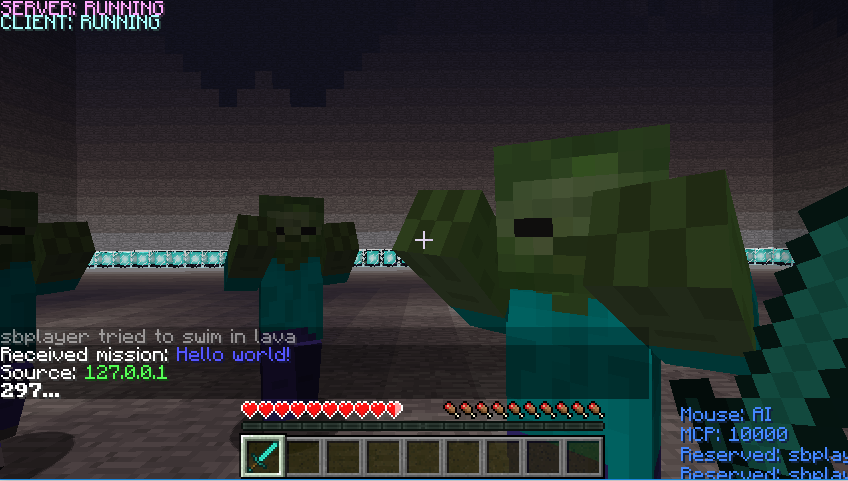
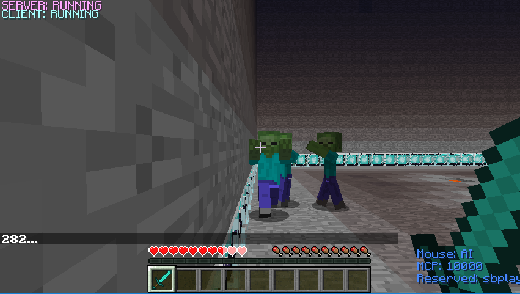
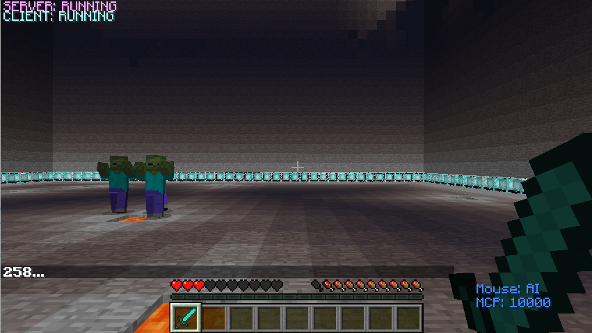
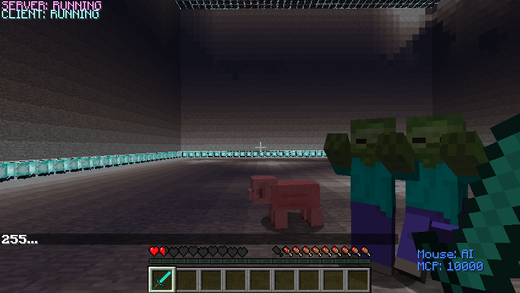
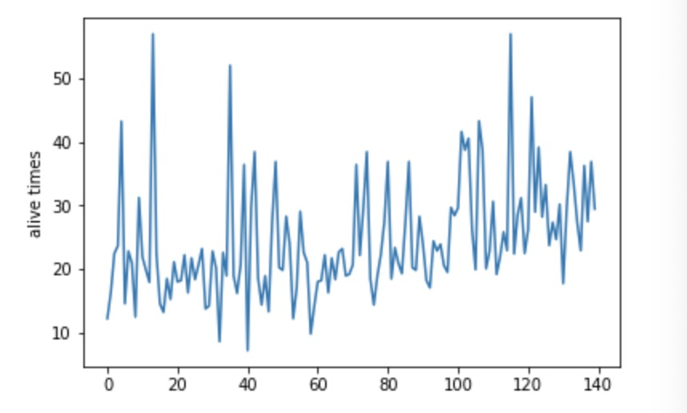
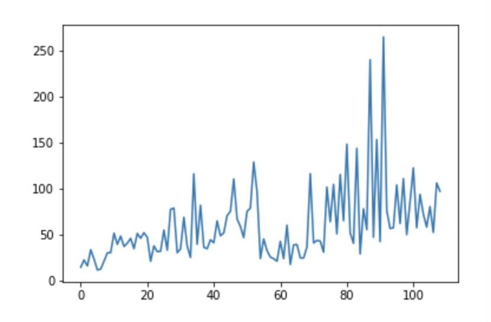
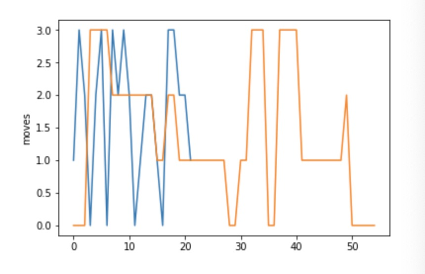

## Video

<div style="position:relative;height:0;padding-bottom:56.25%"><iframe width="533" height="300" src="https://www.youtube.com/embed/o167zavZICI" frameborder="0" allow="accelerometer; autoplay; encrypted-media; gyroscope; picture-in-picture" allowfullscreen></iframe>
</div>

## Project Summary:

As its name suggest, our project idea is inspired by the most polular vedio game PlayerUnknown's Battlegrouds. The goal of this project is to have an agent to survive in the 40x40 flat ground with three enemies(zombies), two pigs, and ten traps spawned randomly in the environment. The agent should survive as long as possible to escape from the acttack of zombies or to kill pigs to increase its health points. The picture below for reference:
<div align="center">

</div>


As for the challenges, we have lots of possible states should be defined in the 40x40 environment. Also, the agent has six actions should be taken into consideration. In the trainning process, the agent should learn to avoid enemies' attacks and make some predictions according to their moves. After trainning the agent, the agent can intelligently avoid the enemies attacks and even attack them to protect itself - this is where we use an AL/ML algorithm. We mainly use reinforcement learning for problem, and we focus on Q-learning in this project.

This project is non-trivial because it is a brand-new experience for us to a create something original program developing from nothing. We implement the most decent algorithm to solve the problem by searching lots of resources online. It is also a kind of process for us to learn new knowledge as a team by communicating, cooperating, and integrating different opinions to reach unanimity. 

## Approaches

We have 3 enemies(zombies), 2 pigs and 10 traps spawn randomly in a 40X40 flat ground. The agent has 6 actions (left, right, forward, backward, attack, stop) and the agent should try to escape from zombies as far as possible to survive in the environment. It can also kill pigs to increase its health point and survival time in the world. 

### Algorithm
And our basic algorithm idea is from CS 175 classes. We decision to use Q-learning algorithm to solve the problem. The Q-learning algorithm's logic is quite similar to the pseudo code given below. The Q-learning algorithm will choose the action with the highest Q-value for each state. The Q-value is calculated based on our defined rewards resulting from a state. The constant α(alpha), γ(gamma), ε(epsilon), and n(backsteps) were used to trim the algorihm and improve the performance.


The constant values work pretty well for our environment, so we perserve the value of each constant. 

```python
   class player(object):
       def __init__(self,alpha=0.3,gamma=1,n=1):
           self.epsilon = 0.3
           self.n, self.alpha,self.gamma = n, alpha, gamma
           self.entities = {}
           self.q_table = {}
```

α = 0.3 - Based on our stochastic environment, we decide to use a small alpha value(0.3) to train our agent. In compromise of learning speed, our agent can learn stably with the small alpha value due to the complicated state and environment. It greatly fits our environment and the performance of agent becomes significantly better after trainning for a while.

γ = 1 - The discount factor gamma determines the importance of future rewards. A factor approaching 1 will make it strive for a long-term high reward. In our case, we set gamma to 1 because our goal is to let the agent survive as long as possible in the world. Thus, this is a decent value in our environment.

ε = 0.3 - Epsilon is the value that how often you want your agent to explore vs exploit. It refers to the random action that our AI will do instead of action with highest Q-value. The random actions will sometimes benefit our agent because it can sometimes escape from the zombies, so we don't set epsilon close to 0 and we set it to 0.3.

n = 1 - n is the number of backsteps to update. We set it to 1 because we want to update our Q table immediately after each action. It works well in our environment. 

What's more, we use update_q_table function to update the table of our agent resulting from rewards and then choose the best move of the agent. 

The agent will deal with the current reward after getting into each move. The agent will update the q_table, which we stores the table as one of our agent. The basic logic of the implementation of updating q_table is Bellman equation provided during the lectures. 
The equation looks like this: Q(s,a) <- Q(s,a)+alpha(r+y(maxQ(s',a')-Q(s,a))). The formula means the expected long-term reward for a given action is equal to the immediate reward from the current action combined with the expected reward from the best future action taken at the following state. The code below perform the above description. 
```python
   def update_q_table(self, tau, S, A, R, T):
        """Performs relevant updates for state tau.

        Args
            tau: <int>  state index to update
            S:   <dequqe>   states queue
            A:   <dequqe>   actions queue
            R:   <dequqe>   rewards queue
            T:   <int>      terminating state index
        """
       # print(S,A,R)
        curr_s, curr_a, curr_r = S.popleft(), A.popleft(), R.popleft()
        G = sum([self.gamma ** i * R[i] for i in range(len(S))])
       # print(G) 
        if tau + self.n < T:
            try:
               G += self.gamma ** self.n * self.q_table[S[-1]][A[-1]]
            except:
               pass
        if(curr_s not in self.q_table):
           self.q_table[curr_s] = {}
        if(curr_a not in self.q_table[curr_s]):
           self.q_table[curr_s][curr_a] = 0
        old_q = self.q_table[curr_s][curr_a]
        self.q_table[curr_s][curr_a] = old_q + self.alpha * (G - old_q)
```

### Action
The agent has 6 actions now (left, right, forward, backward, attack, stop). The agent can run 4 different directions and even stop to escape from enemies' attacks. To benefit from the environment, the agent can attack its prey(pigs) to increase its health points according to its rewards.


<div align="center">
 
<br />
 
</div> 

Below is corresponding action pseudocode code for reference.
```python
   if(act=='forward'):
        agent moves forward
   elif(act=='backward'):
        agent moves backward
   elif(act=='left'):
        agent moves left
   elif(act=='right'):
        agent moves right    
   elif(act == 'stop'):
        agent stops
   elif(act == 'attack'):
        agent attacks preys
```


### State Space
<div align="center">


</div> 

After every move of our agent, the agent will get a current state and store the privous state. There are states we have. The first one is our health points, the second and third one is the relative distance of the closest two enemies surrounding the agent. The fourth one is the position of pigs surrouding the agent. 

From the picture draw above, we use the tangent calculated by the agent position and the enemy's postion to detect the nearby enemies seperated to 0-7 directions. The red spot represents the position of the agent. In the circle with radius 2, the agent can attack to kill a pig to increase its health points. If the agent don't detect the pigs in the circle with radius 2, it will return -1 to the current state. The agent can also detect the enemies by two different ways. In the circle with radius 8, the agent will get more punishments to escape from enemies as far as possible. Outside the circle with radius 8, the agent will also try to keep away from its enemies but with less punishments. 

### Rewards
For the reward part, we set different kinds of rewards for the agent to learn from the environment. 

The health points of 0 means the agent dies and reward is -1000. 1 means the agent is half alive and the reward is -100. 2 means the agent is full alive and the reward is +5. When the agent doesn't detect the nearby enemies, the reward is +100. When the enemies are in the distance of 8, the reward is -50, otherwise, the reward is -5. The agent will always compute the total reward it gains by checking its current state and it stores current and next status, action, reward for upating q-table. If agent find its health points reach 0, it will return the final reward to the terminal and quit the game immediately without continuing any afterward steps. If it is still alive, the agent will continue to find the next action and act. The code below perform the above description.

```python
   possible_actions = self.get_possible_move(agent_host)
   a0 = self.choose_move(s0, possible_actions, self.epsilon)
   S.append(s0)
   A.append(a0)
   R.append(0)
   T = sys.maxsize
   for t in range(sys.maxsize):
       time.sleep(0.1)
           if t < T:
               current_r = 0
               elf.act(agent_host,A[-1])
               temp_s = self.get_curr_state(agent_host)
               #print(temp_s[0])
               if(temp_s[0]==0):
                   current_r=-1000
                   time.sleep(1)
               elif(temp_s[0]==1):
                   current_r=current_r-100
                   elif(temp_s[0]==2):
                   current_r=current_r+5

               for y in range(1,3):
                   if(temp_s[y][0]==0):
                       current_r = current_r-5
                   elif(temp_s[y][0]==1):
                       current_r = current_r-50
                   elif(temp_s[y][0]==-1):
                       current_r = current_r+100
                R.append(current_r)
                if(temp_s[0]==0):
                    # Terminating state
                    agent_host.sendCommand('quit')
                    T = t + 1
                    S.append('Term State')
                    present_reward = current_r
```

##  Evaluation
We will assess our AI using both qualitative and quantitative mathods and illustrate the performance of our agent using statistics graph.

#### Quantitative evaluation
We use the alive time of the agent in the increasing episodes to evaluate our agent's performance quantitatively(we show the best move after every 5 episodes).



From the graph above, it is the agent who can't attack preys to increase its health points. As we can see from the plot, the alive time for our agent is increasing gradually from first 10s to the last 30s, although the alive time at the end is still low.



In our improved agent who can attack pigs to increase its health points, it appears that the alive time is increasing notably from beginning 20s to at most 250s in the end. The modified algorithm and the new action "attack" successfully increase the agent's survival time after trainning for a while. Our improved agent now's performance is more consistent and stable because we consider more comprehensive states situation and the action to attact preys to increase its HP. The agent can survive much longer at the end of our trainning.



In this picture above, the yellow line appears that our improved agent can be more stable to do some continuous moves. It also shows that our algorithm is fit to our agent in the environment.

#### Qualitative evaluation

Our way to qualitatively evaluate the agent is observing its moves and actions and whether our AI is intelligently escaping from enemies or just randomly moving in the environment. There is a video at the top of the page to vividly illustrate how our agent can trainedly escape from enemies and survive in the world as long as possible.

## Reference
We mainly used the class notes and textbook for our  reference material. Below are some additional resources for us to learn and improve our algorithm. 

1.The resource used for deep q learning tutorial:[https://sergioskar.github.io/Deep_Q_Learning/](https://sergioskar.github.io/Deep_Q_Learning/)

2.The simple reinforcement learning tutorial: [https://medium.com/emergent-future/simple-reinforcement-learning-with-tensorflow-part-0-q-learning-with-tables-and-neural-networks-d195264329d0](https://medium.com/emergent-future/simple-reinforcement-learning-with-tensorflow-part-0-q-learning-with-tables-and-neural-networks-d195264329d0)


