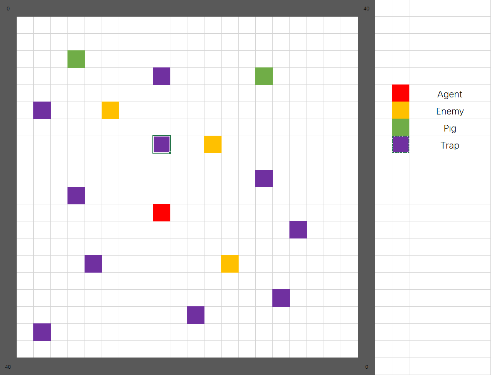
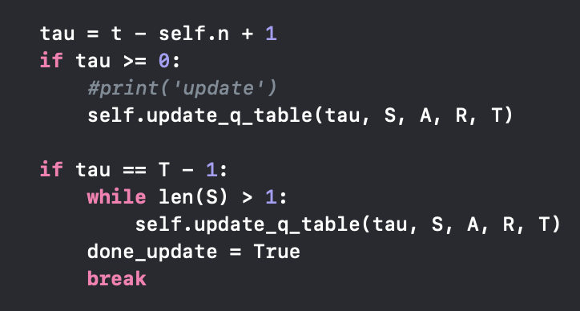

## Project Summary:

As its name suggest, our project idea is inspired by the most polular vedio game PlayerUnknown's Battlegrouds. The goal of this project is to have an agent to survive in the 40x40 flat ground with three enemies(zombies), two pigs, and ten traps spawned randomly in the environment. The agent should survive as long as possible to escape from the acttack of zombies or to kill pigs to increase its health points. The picture below for reference:
<div align="center">

</div>


As for the challenges, we have lots of possible states should be defined in the 40x40 environment. Also, the agent has six actions should be taken into consideration. In the trainning process, the agent should learn to avoid enemies' attacks and make some predictions according to their moves. After trainning the agent, the agent can intelligently avoid the enemies attacks and even attack them to protect itself - this is where we use an AL/ML algorithm. We mainly use reinforcement learning for problem, and we focus on Q-learning in this project.

This project is non-trivial because it is a brand-new experience for us to a create something original program developing from nothing. We implement the most decent algorithm to solve the problem by searching lots of resources online. It is also a kind of process for us to learn new knowledge as a team by communicating, cooperating, and integrating different opinions to reach unanimity. 

## Approaches

We have 3 enemies(zombies), 2 pigs and 10 traps spawn randomly in a 40X40 flat ground. The agent has 6 actions (left, right, forward, backward, attack, stop) and the agent should try to escape from zombies as far as possible to survive in the environment. It can also kill pigs to increase its health point and survival time in the world. 

### Algorithm
And our basic algorithm idea is from CS 175 classes. We decision to use Q-learning algorithm to solve the problem. The Q-learning algorithm's logic is quite similar to the pseudo code given below. The Q-learning algorithm will choose the action with the highest Q-value for each state. The Q-value is calculated based on our defined rewards resulting from a state. The constant α(alpha), γ(gamma), ε(epsilon), and n(backsteps) were used to trim the algorihm and improve the performance.


The constant values work pretty well for our environment, so we perserve the value of each constant. 

```python
   class player(object):
       def __init__(self,alpha=0.3,gamma=1,n=1):
           self.epsilon = 0.3
           self.n, self.alpha,self.gamma = n, alpha, gamma
           self.entities = {}
           self.q_table = {}
```

α = 0.3 - Based on our stochastic environment, we decide to use a small alpha value(0.3) to train our agent. In compromise of learning speed, our agent can learn stably with the small alpha value due to the complicated state and environment. It greatly fits our environment and the performance of agent becomes significantly better after trainning for a while.

γ = 1 - The discount factor gamma determines the importance of future rewards. A factor approaching 1 will make it strive for a long-term high reward. In our case, we set gamma to 1 because our goal is to let the agent survive as long as possible in the world. Thus, this is a decent value in our environment.

ε = 0.3 - Epsilon is the value that how often you want your agent to explore vs exploit. It refers to the random action that our AI will do instead of action with highest Q-value. The random actions will sometimes benefit our agent because it can sometimes escape from the zombies, so we don't set epsilon close to 0 and we set it to 0.3.

n = 1 - N is the number of backsteps to update. We set it to 1 because we want to update our Q table immediately after each action. It works well in our environment. 

What's more, we use update_q_table and choose_move function to update the table of our agent resulting from rewards and then choose the best move of the agent. The agent will deal with the current reward after getting into each move. The agent will update the q_table, which we stores the table as one of our agent. The basic logic of the implementation of updating q_table is Bellman equation provided during the lectures. 
The equation looks like this: Q(s,a) <- Q(s,a)+alpha(r+y(maxQ(s',a')-Q(s,a))). According to the tutorial online, the formula means "the expected long-term reward for a given action is equal to the immediate reward from the current action combined with the expected reward from the best future action taken at the following state." The code below perform the above description.
```python
   def update_q_table(self, tau, S, A, R, T):
        """Performs relevant updates for state tau.

        Args
            tau: <int>  state index to update
            S:   <dequqe>   states queue
            A:   <dequqe>   actions queue
            R:   <dequqe>   rewards queue
            T:   <int>      terminating state index
        """
       # print(S,A,R)
        curr_s, curr_a, curr_r = S.popleft(), A.popleft(), R.popleft()
        G = sum([self.gamma ** i * R[i] for i in range(len(S))])
       # print(G) 
        if tau + self.n < T:
            try:
               G += self.gamma ** self.n * self.q_table[S[-1]][A[-1]]
            except:
               pass
        if(curr_s not in self.q_table):
           self.q_table[curr_s] = {}
        if(curr_a not in self.q_table[curr_s]):
           self.q_table[curr_s][curr_a] = 0
        old_q = self.q_table[curr_s][curr_a]
        self.q_table[curr_s][curr_a] = old_q + self.alpha * (G - old_q)
```
```python
   def choose_move(self,c_state,pm,eps):
      print(pm)
      if c_state not in self.q_table:
         self.q_table[c_state] = {}
         for action in pm:
            if action not in self.q_table[c_state]:
               self.q_table[c_state][action] = 0

      rnd = random.random()
      if(rnd<=eps):
        a = random.randint(0,len(pm)-1)
        print(pm[a])
        return pm[a]
      else:
        max_list = []
        act_reward = sorted(self.q_table[c_state].items(),key=lambda x:x[1],reverse = True)
        maxa = -1
        for i in range(len(act_reward)):
            if(act_reward[i][0] in pm):
              maxa = act_reward[i][1]
              break
        for item in act_reward:
            if(item[1] >= maxa and item[0] in pm):
               max_list.append(item[0])
        if(len(max_list)>1):
           a = random.randint(0,len(max_list)-1)
        elif(len(max_list)==1):
           a = 0
        else:
           print(pm[0])
           return pm[0]
        print(max_list[a])
        return max_list[a]
```
First of all, the agent with its current state will get a list of possible actions and choose a move by implementing ε-Greedy Policy. Instead, The agent returns a random action with probability eps, but with (1-eps) it picks the action with the highest Q-value. The code below perform the above description.


After every move of our agent, the agent will get a current state and store the privous state. There are states we have. The first one is our health points, the second and third one is the relative distance of the closest two enemies surrounding the agent. The health points of 0 means the agent dies and reward is -1000. 1 means half alive and the reward is -50. 2 means full alive and the reward is +50. The distance value of 0 means greater distance between the agent and the enemy and the reward is +50. The distance value of 1 means closer distance and reward is -50. The agent will always compute the total reward it gains by checking its current state and it stores current and next status, action, reward for upating q-table. If agent find its health points reach 0, it will return the final reward to the terminal and quit the game immediately without continuing any afterward steps. If it is still alive, the agent will continue to find the next action and act. The code below perform the above description.




### Action 


### State Space

From the picture draw above, we use the tangent calculated by the agent position and the enemy's postion to detect the nearby enemies. In the circle with radius 2, the agent can attack to kill a pig to increase its health points, and the reward is (). The agent can also detect the enemies in the circle with radius 8. There are 8 different areas which seperated by tangent. In these areas, the agent can try to escape from the enemies as far as possible with a reward (). 

### Rewards
